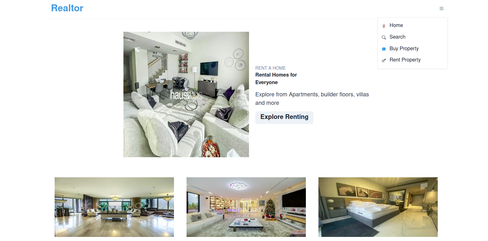
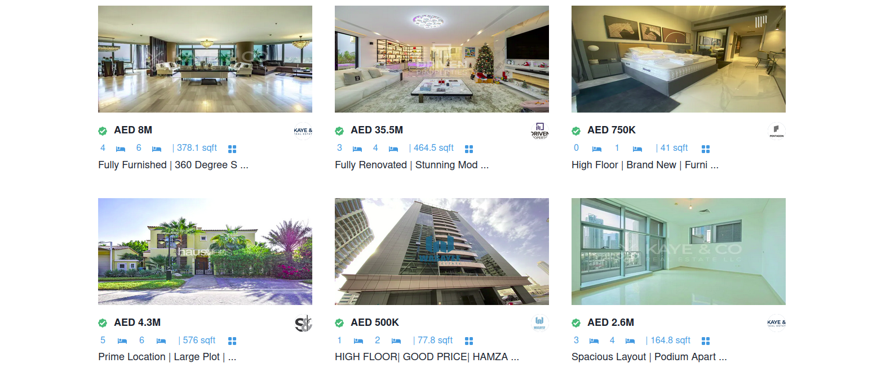
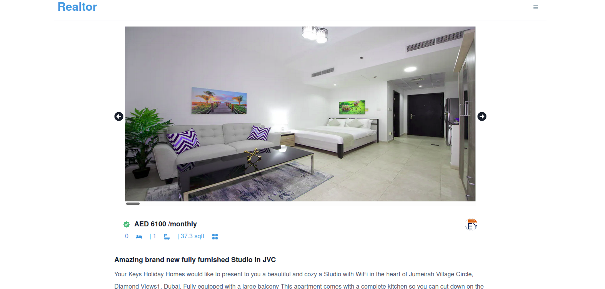

## Realtor

Nextjs Application displaying and filtering property available for sale/Rent by consuming the RapidAPI

Open [https://real-estate-app-dfn9sf20r-kenny-kogi.vercel.app/](https://real-estate-app-dfn9sf20r-kenny-kogi.vercel.app/) with your browser to view the live version.

## Tools

<ul>
<li>Nextjs</li>
<li>Reactjs</li>
<li>RapidApi</li>
<li>vercel</li>
</ul>

## Installation

First, clone the repository:

```bash
git clone git@github.com:kenny-kogi/_Real-Estate-App.git

cd _Real-Estate-App/

npm install && npm run dev
```

Open [http://localhost:3000](http://localhost:3000) with your browser to see the result.

## Screenshots

<Flex flexwrap="wrap">



</Flex>
